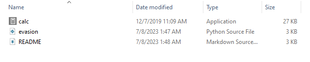
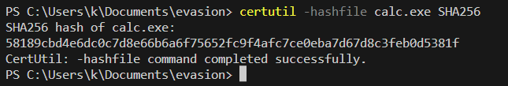
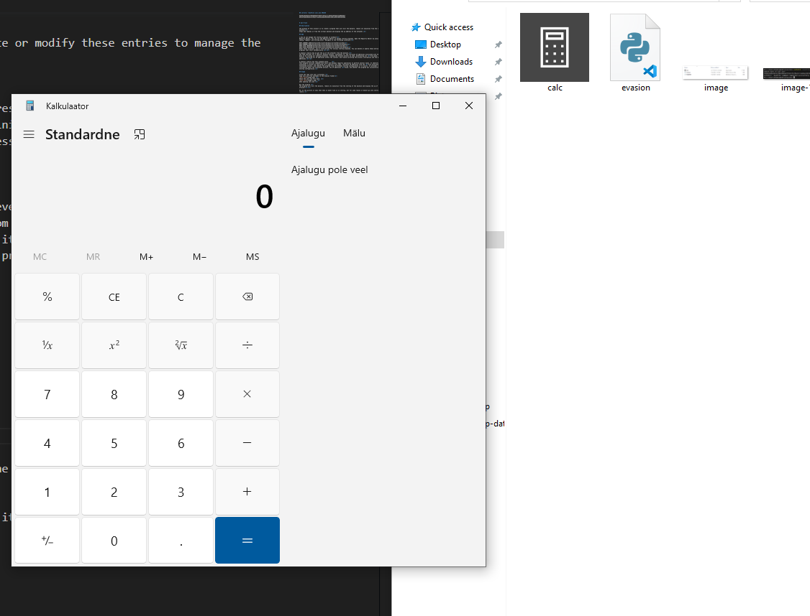
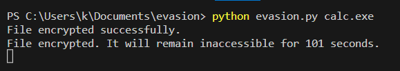
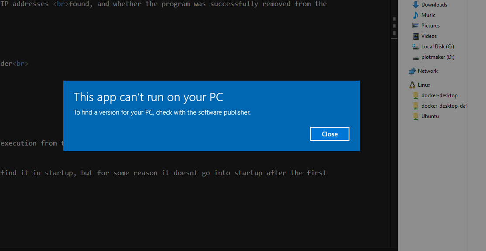
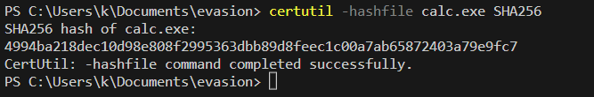

# evasion

## Description

You will need to develop a windows program 
The windows program will have to give us the possibility to encrypt another program 
Increase its size by 101mb 
Add an increment of an int to 100001 
Look at the time, do a sleep of 101 seconds, look at the time to check that 101 seconds has passed, if the 101 seconds have not  elapsed, do not decrypt the binary and do not execute it 

## Q&A

1. Antivirus software detects viruses by comparing file code patterns against a database of known virus signatures, monitoring  program behavior for suspicious activities, and using heuristics and machine learning algorithms to identify new  threats based on behavior and characteristics.  

2. To bypass antivirus software, attackers can use techniques such as encrypting or obfuscating malware code, employing packers  or compressors, utilizing polymorphic or metamorphic techniques, leveraging rootkits to hide malicious activities, or  exploiting zero-day vulnerabilities until they are detected and patched.  

3. This program takes a file path as input and performs encryption on the specified file using XOR encryption with a given key.  It then increases the file size by adding additional data and an increment value. The program checks for a specific process  ("calc.exe") and terminates it if found. After a delay, the file is decrypted using the same key, restoring it to its  original form.  

## Usage

Clone the repo into your virtualbox. 
Copy calc.exe from system32 to the evasion folder 
  
Check the calc.exe file hash.  
  
when opening calc.exe  
 
Run the program  
 
and now when opening calc.exe 
 
and checking new hash: 
 
and new file size: 
 
After 101 seconds the file will be decrypted and the calc.exe can be openend normally. 

## Audit

- [Audit file](https://github.com/01-edu/public/tree/master/subjects/cybersecurity/evasion/audit)

## Author

**Raido Lump**
- [Git profile](https://01.kood.tech/git/raidoxd "raidoxd")
- Discord - Friendly#4382