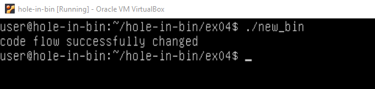

# hole-in-bin

## Description

This exercise is designed to test your skills and understanding of binary exploitation and reverse engineering.  You will need to work through a series of binary exploitation challenges using a provided virtual machine.  
Inside the /opt/hole-in-bin directory, you will find a set of binaries (ex00 to ex11) that you need to exploit.  Each binary presents a unique challenge and will test different aspects of your knowledge about binary  exploitation and reverse engineering.   
Commands used:  
objdump |less : for reading the bin file 
xxd : for converting the bin file to hex 
nano : for editing the hex file  

## ex00
Output that i need to get: "you have changed the 'modified' variable"
  
First i read the bin file and found "int volatile modified 0x5c", then i found it here:   
  
Then i converted the bin file to hex"xxd bin > hex" and edited the hex file "nano hex".  
Then i changed the value to 00.  
Now i converted the hex file back to bin "xxd -r hex new_bin" and ran the bin file "./new_bin".  
  

## ex01
Output that i need to get: "you have correctly got the variable to the right value"
  
  
Here i discovered that it compared something to 0x00000000.  
  
In the main function i discovered the "cmp" command.  
and then i changed the value to 0x00000000  
same way as in previous exercise.  
  

## ex02
Output that i need to get: "you have correctly modified the variable"
  
 
Here i discovered that it again compared something to 0x00000000.  
  
here i once again saw the "cmp" command.  
and then i changed the value to 0x00000000  
same way as in previous exercise.  
  

## ex03
Output that i need to get: "code flow successfully changed"
  
This time i found that ./bin didnt work, so i checked the README file and there it said that i needed to change  the code flow  
I checked the bin file and found now there was 2 functions.  
So to change the code flow i changed what func its going to call in "start"function.  
I saw that main was being called with 0x8048438 so i changed it to 0x8048424 to call the win function.  
  
  

## ex04
Output that i need to get: "code flow successfully changed"
  
This time it said again to change the code flow.  
So i did the exact same steps.  
    
This time it was 0x8048408 and needed to change it to 0x80483f4.  
  

## ex05
Output that i need to get: "you have hit the target correctly"
  
This time i found vuln function that gets called inside the main function  
and it has a jne command that is always true.  
  
So i changed the jne command to nop command.  
 
  

## ex06
Output that i need to get: "that wasn't too bad now, was it?"
  
This time i again found 2 functions in bin file.  
and on them was name Winner so i thought of changing from calling main to calling winner function.  
  
changed the push from 8048889 to 8048864 in start.  
  

## ex07
Output that i need to get: "you have modified the target"
  
This time again saw the vuln fucntion and doing the exact same steps as in ex05.  
but with different address.  

## ex08
Output that i need to get: "you have modified the target"
  
This time again saw the vuln fucntion and doing the exact same steps as in ex05.  
but with different address.  

## ex09
Output that i need to get: "code execution redirected"
  
Here i see that there is a second funtion called hello.  
So like previously, i thought of changing from calling main to calling hello function. 
 

## ex10
Output that i need to get: "level passed"
  
Here i see that there is a second funtion called winner.  
So like previously, i thought of changing from calling main to calling winner function. 

## ex11
Output that i need to get: "and we have a winner"
  
Here i see that there is a second funtion called winner.  
So like previously, i thought of changing from calling main to calling winner function. 

  

## Audit

- [Audit file](https://github.com/01-edu/public/tree/master/subjects/cybersecurity/hole-in-bin/audit)

## Author

**Raido Lump**
- [Git profile](https://01.kood.tech/git/raidoxd "raidoxd")
- Discord - Friendly#4382