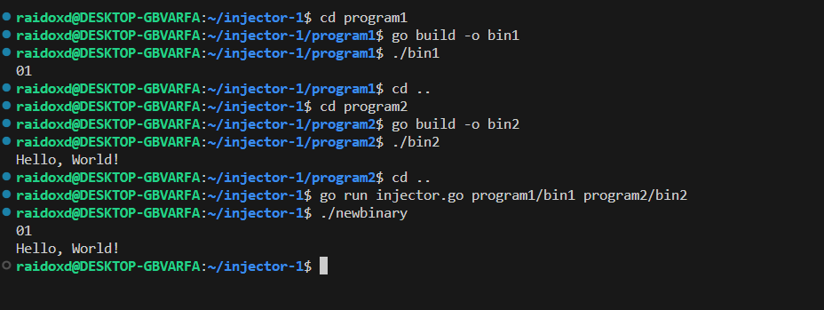

# local

## Description

The goal of this project is to develop a binder that merges two programs into one   
I first created 2 programs called bin1 that prints out 01 and another program called bin2 that prints out Hello, World!  
and then i made them into binary/executable files.   
I then created a program called injector that takes in 2 arguments, the first argument is the path to the binary/executable file of bin1 and the second argument is the path to the binary/executable file of bin2.   
The injector.go file creates a wrapper binary that combines two existing binary files into a single executable.  The two binary files are read and encoded as base64 strings. Then, a Go source code template is defined, which  includes the base64-encoded data and code to decode and execute the binaries from memory. The Go source code  is written to a temporary file, compiled into the wrapper binary using the Go compiler, and saved as  "newbinary". The wrapper binary can be executed to run both binary1 and binary2 sequentially. 

Usage: 

## Audit

- [Audit file](https://github.com/01-edu/public/tree/master/subjects/cybersecurity/injector/audit)

## Author

**Raido Lump**
- [Git profile](https://01.kood.tech/git/raidoxd "raidoxd")
- Discord - Friendly#4382