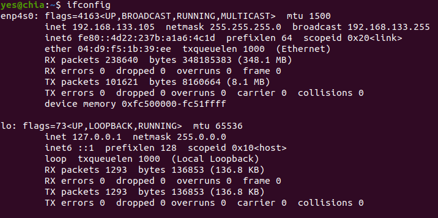

# local

## Description

In this project you will learn about Privilege escalation We will provide a VM 01-Local1.ova. You have to install  it locally in VirtualBox And then found a way to go inside it and get root access. There will be no visible IP  address, you must find a way to get it. You have to become root and get the flag.  

Privilege escalation refers to the process of gaining higher levels of access or privileges within a system or  network than what was initially granted. It allows an attacker or user to bypass security measures and gain  elevated control, potentially leading to unauthorized actions or compromising sensitive information.  

Each exploit used in this can be fixed:
1. you can close the port 21 and/or dont let anonymous login
2. dont keep user and password in a file
3. dont let user run python with sudo

## Instructions

1. prepare your virtual machine 
download virtualbox 
install 01-Local1.ova in virtualbox 
check if you have the right version of 01-Local1.ova 
 
start 01-Local in virtualbox 

2. find ip of 01-Local 
Using ifconfig: 
 
Now we go over the 192.168.133.0-255 
Using nmap -sP: 
 
We find that for my instance the ip is 192.168.133.112 

3. find open ports 
Using nmap -A: 
  
We find that there are 3 open ports 22, 21, 80 
and we find that 80 is running apache 
so we can check it in our browser 
  
We find that on port 21 there is ftp server running 
and we can login as anonymous 
also we find that there are files in the ftp server 

4. upload reverse shell and .py file for further need 
We can upload files using ftp after logging in 
  

5. Activate reverse shell 
  
Now we can click on the reverse shell(local.php) and it will open in our browser 
and at the same time you should have nc listener running for the port number thats in local.php 
using command: nc -lvnp "port number" 
  
now you have access to the machine 
6. find a way to get virtualbox user and password 
type ls to find all the files 
  
after a bit of looking around you find /.runme.sh 
look whats inside of it using command: cat /.runme.sh 
  
we find that the username is shrek 
and the password is hashed 
go to https://www.dcode.fr/hash-function. to find password 

7. login as shrek into virtualbox 
  
check sudo -l for your sudo permissions 
 
find you can run python3.5 as root 
find the file from: /var/www/html/files  
 
run the file using: sudo python3.5 local.py 
 
find the flag in /root directory 
use cat root.txt to read the flag 
  

Objective Completed

## Audit

- [Audit file](https://github.com/01-edu/public/tree/master/subjects/cybersecurity/local/audit)

## Author

**Raido Lump**
- [Git profile](https://01.kood.tech/git/raidoxd "raidoxd")
- Discord - Friendly#4382
