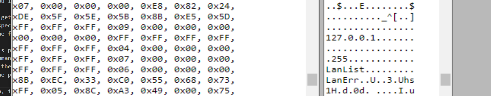
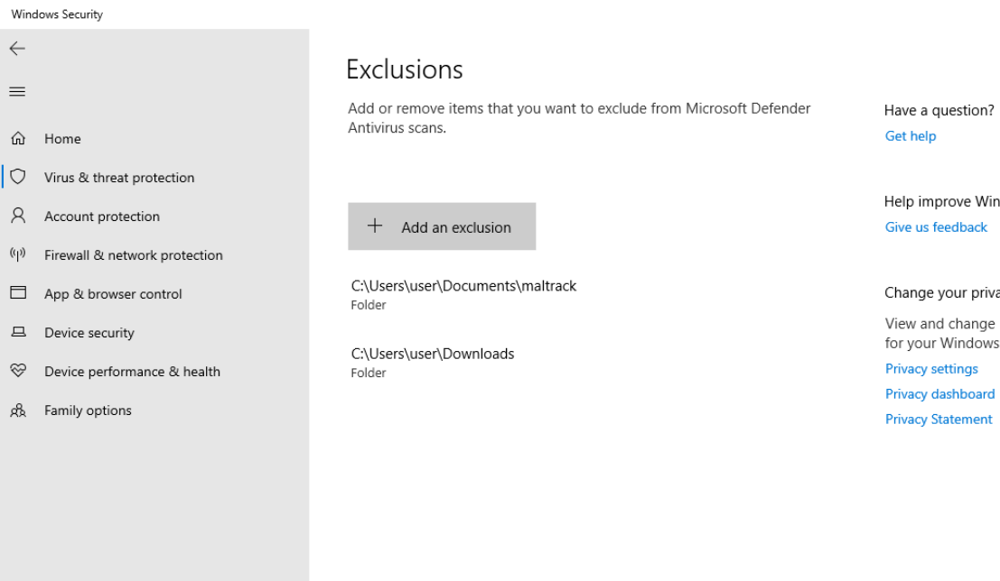
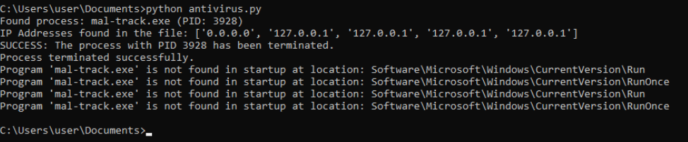

# mal-track

## Description

The purpose of this project is to create a program that will kill the malware, remove its execution from the startup of the machine, 
stops and removes it from the virtual machine and display the ip address of the attacker. 

## Q&A

1.how we can manage the startup programs in windows? 
Registry Editor: You can use the Registry Editor to manage startup programs. Open the Registry Editor by pressing Win + R, then typing "regedit" and hitting Enter. Navigate to the following locations: 

HKEY_CURRENT_USER\Software\Microsoft\Windows\CurrentVersion\Run 
HKEY_CURRENT_USER\Software\Microsoft\Windows\CurrentVersion\RunOnce 
HKEY_LOCAL_MACHINE\Software\Microsoft\Windows\CurrentVersion\Run 
HKEY_LOCAL_MACHINE\Software\Microsoft\Windows\CurrentVersion\RunOnce 
Under these locations, you'll find entries for various startup programs. You can delete or modify these entries to manage the programs that start automatically.  

2.explain clearly how we get the ip of the attacker from the malware. 
The code searches for a specific malware process, terminates it, and retrieves IP addresses associated with the attacker. It does so by listing all running processes, finding the malware process by name, determining its  file path, reading the file content, searching for IP addresses within the content, and finally printing the process information and the discovered IP addresses.  

3.explain clearly how this program works.     
This program utilizes command-line tools and Windows registry operations to perform several tasks. It identifies and forcefully terminates a process by searching for a specific file name, retrieves IP addresses from the  file associated with the terminated process, and removes the program from the Windows startup configuration if it exists. It provides users with detailed information about the terminated process, the IP addresses  found, and whether the program was successfully removed from the startup configuration. 

4. To manually get the ip, i can just go into a file to hex online converter i used https://tomeko.net/online_tools/file_to_hex.php?lang=en and search for the ip in the hex code. 
  

## Usage

Install the maltrack into your windows virutalbox. 
Add the maltrack to antivirus exception list. 
  
Run the program.  
Download the mal-track.py file and run it cmd as admin.  
  
The program will kill the malware, remove its execution from the startup of the machine and display the ip of the attacker  

PS: In the picture it says that that it didnt find it in startup, but for some reason it doesnt go into startup after the first remove. 

## Audit

- [Audit file](https://github.com/01-edu/public/tree/master/subjects/cybersecurity/mal-track/audit)

## Author

**Raido Lump**
- [Git profile](https://01.kood.tech/git/raidoxd "raidoxd")
- Discord - Friendly#4382