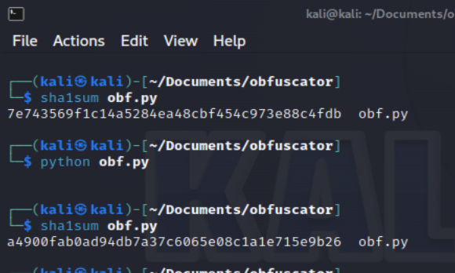
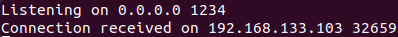
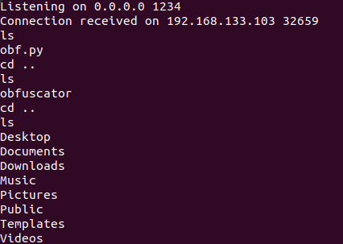

# obfuscator

## Description

The goal of this project is to understand polymorphic encryption.  Principle used by computer virus developers to change the signature of their programs.

## Q&A

1. What polymorphic encryption means? 
Polymorphic encryption is a security method that continuously modifies  encryption algorithms and keys, making it difficult for attackers to analyze  or decrypt data. It adds an extra layer of protection against  advanced threats by rendering traditional decryption methods ineffective.
  

2. How we change the signature with each execution? 
The code used the change_file function to replace function names within the file. By  generating random names with generate_new_name and updating the function definitions  accordingly, the code dynamically altered the function signatures on each  execution, resulting in a changed signature.
  

3. How this program works.     
This program consists of two functions. The shell function executes a bash  command, while the change_file function changes function  names in a file by generating random names and replacing the original names.
 

## Usage

I did this between Kali linux(the target) and Ubuntu(the attacker). 
First lets check signature of the file before and after running it. 
  
Now for the reverse shell im going to listen on port 1234 with my attacker machine and run the file on my target machine. 
  
I then see that i have access to my target machine by using some simple commands. 
  

## Audit

- [Audit file](https://github.com/01-edu/public/tree/master/subjects/cybersecurity/obfuscator/audit)

## Author

**Raido Lump**
- [Git profile](https://01.kood.tech/git/raidoxd "raidoxd")
- Discord - Friendly#4382