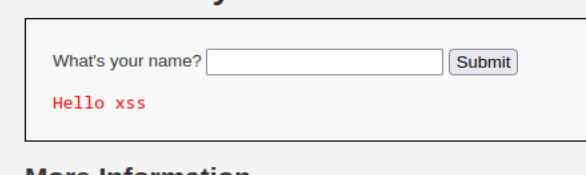
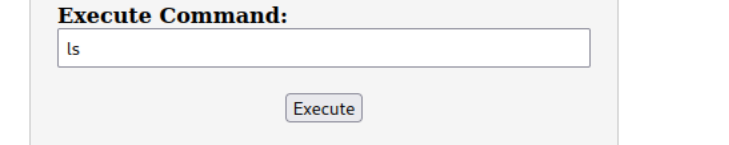

# local

## Description

Deploy the DVWA web platform, find at least 3 vulnerabilities and develop a c99, r57 type shell. Your php shell  should allow you to add a file, delete a file, and execute a command.
  

## 3 vulnerabilities

 
1. SQL Injection: SQL injection is a web application vulnerability that allows an attacker to manipulate the SQL  queries executed by the application's database. In DVWA, there are scenarios where user input is not properly  sanitized or validated before being used in SQL queries. This can enable an attacker to insert malicious SQL code  into the application, potentially gaining unauthorized access to the database, retrieving sensitive information,  modifying data, or even executing arbitrary commands on the underlying system.  
Example: searching by 1 vs ' OR '1'='1  

 
 
To prevent SQL injection, always use parameterized queries or prepared statements with bound parameters instead of  dynamically concatenating user input into SQL queries. This ensures that user input is treated as data rather  than executable code. Additionally, perform input validation and sanitization to block or filter out  potentially malicious characters or sequences.

 
2. Cross-Site Scripting (XSS): XSS is a vulnerability that occurs when an application fails to properly validate  or sanitize user-supplied input, allowing an attacker to inject malicious scripts into web pages viewed by  other users. DVWA includes several XSS vulnerabilities that can be exploited to perform actions on behalf of  unsuspecting users, steal their session cookies, or redirect them to malicious websites. Successful  exploitation of XSS can lead to various attacks, including session hijacking, defacement of websites, and  stealing sensitive information. 
Example: inserting xss vs `script>alert('xss');/script>` 

 
 
Prevent XSS by properly validating and sanitizing user input before displaying it in web pages. Use output  encoding or HTML escaping to ensure that user-supplied content is rendered as plain text and not interpreted as  HTML or JavaScript code. Employ Content Security Policy (CSP) headers to restrict the execution of untrusted  scripts.
  
3. File upload vulnerabilities are security weaknesses that can be exploited by attackers to upload malicious  files to a web application. 
Example: uploading a file with php code that will be executed on the server 
 

To prevent file upload vulnerabilities, always validate and sanitize user input before allowing it to be  uploaded to the server. Additionally, ensure that uploaded files are stored outside of the web root directory  and that they cannot be executed by the web server.

## webshell

Uploaded a file using file upload vulnerability in DVWA. The file contained php code that allowed me to   upload/delete files and execute commands on the server.  
 
then going to the file location thats on the image 5 
 
In here i can upload/delete files and execute commands on the server 
Uploading a file 
  
choosing test.txt  
  
execute  
  
check if file is there  
  
  
check whats inside the file  
  
  
and now deleting the file 
  
  
  
  

## Audit

- [Audit file](https://github.com/01-edu/public/tree/master/subjects/cybersecurity/web-hack/audit)

## Author

**Raido Lump**
- [Git profile](https://01.kood.tech/git/raidoxd "raidoxd")
- Discord - Friendly#4382